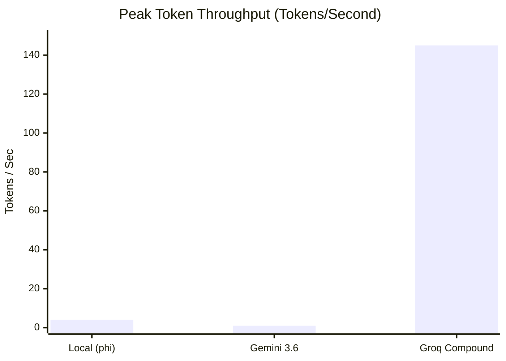

<p align="center">
  
</p>

<h1 align="center">🌙🦋 YUI</h1>

<p align="center">
  <b>A privacy-first, multimodal desktop AI agent.</b>
</p>

<p align="center">
  
  
  
  
  
  
</p>

---

## ⚡ What is YUI?

**YUI** is an autonomous, OS-level AI assistant inspired by the AI guide from Sword Art Online. I wanted to build a real-world desktop companion—not just a chatbot.

### 🌟 Evolution
The journey started in Class 10 with a simple Python voice bot that could open apps, search Google, and play YouTube. Instead of abandoning it, I kept upgrading the same idea for 6 years:
- **Class 10**: Voice assistant + desktop automation.
- **HackHazards**: Added Groq, ScreenPipe & screen-aware UI automation.
- **Intel GSoC**: Rebuilt it with OpenVINO, OmniParser, FAISS memory & adaptive routing.

Today, YUI combines local LLMs, hardware-accelerated computer vision (OmniParser), and generic browser orchestration into a unified 3-panel React dashboard. It operates entirely on-device by default, utilizing Intel Core Ultra NPUs for deep learning workloads, while seamlessly routing highly complex tasks to cloud models during peak system stress.


---

## 🚀 Key Features & How to Test Them

### 🧠 Persistent RAG Memory & Workflow Macros
YUI remembers your past conversations and learns from successful agentic tasks by serializing them into a FAISS vector database.
* **Observe Memory**: Chat with YUI normally, then later ask *"What were we just talking about?"* or *"What did I ask you earlier?"*. YUI will pull context from FAISS via `all-MiniLM-L6-v2`.
* **Observe Macros**: Ask YUI to do a multi-step task, e.g., *"open notepad and type hello"*. Wait for it to succeed. Ask the exact same command again, and watch the agent skip the LLM planner and instantly execute the cached macro!

### 🌐 Universal Browser Agent (Playwright)
YUI handles web navigation dynamically without hardcoded parsers, converting OmniParser coordinates to Playwright DOM clicks.
* **Observe Browser Agent**: Command YUI: *"go to github.com and search for YUI"*. Watch the `[AGENT:STEP]` logs in the React UI as it autonomously navigates, waits, and types into the search box.

### 🔌 Adaptive Compute Router
YUI monitors your PC's CPU and RAM. If the system is under heavy load (Emergency State) or you ask a complex coding question, it routes inference to Groq/Claude instead of the local Ollama instance.
* **Observe Routing**: Open several heavy applications to spike your CPU usage > 85%, then ask YUI a complex logic question. Check the backend console to see the `[ROUTER] System stressed. Offloading to cloud.` message.

### 👁️ NPU-Optimized OmniParser Vision
When executing desktop interactions, YUI takes screenshots, runs them through the Microsoft OmniParser vision model via OpenVINO, and extracts bounding boxes.
* **Observe NPU**: Run any UI-clicking task and watch your Flask server terminal. If you are on an Intel Core Ultra device, you will see `[NPU] Intel Core Ultra NPU detected. Optimizing OmniParser for NPU...` followed by lightning-fast UI element detection.

---

## 📊 Benchmark Results

The biggest takeaway from these tests wasn\'t speed—it was reliability. During heavy parallel load, cloud APIs hit rate limits while the local OpenVINO model maintained 100% uptime on CPU.

YUI includes a built-in benchmarking suite to compare local models against cloud APIs under varying system loads.

| Benchmark Task | 🐢 Local (phi) | ⚡ Cloud (Groq) | ☁️ Cloud (Gemini) |
|----------------|----------------|-----------------|-------------------|
| **Fact Retrieval** | `3598 ms` (0.6 t/s) | `2439 ms` (16.8 t/s) | `2685 ms` (0.4 t/s) |
| **Explanation** | `13798 ms` (3.6 t/s)| `3756 ms` (**143.5 t/s**) | `2068 ms` (1.0 t/s) |
| **Code Generation** | `12193 ms` (4.1 t/s)| `9546 ms` (**145.2 t/s**) | `12019 ms` (Err) |
| **Summarization** | `11726 ms` (4.3 t/s)| `8859 ms` (Err) | `7226 ms` (0.1 t/s) |
| **System Reasoning** | `13210 ms` (3.8 t/s)| `3999 ms` (Err) | `15581 ms` (Err) |

*(Note: "Err" denotes API rate limits/timeouts during heavy parallel load testing. Local models always ensure 100% uptime)*




---


## 📦 Tech Stack

| Layer | Technology |
|-------|-----------|
| **Frontend** | React 19, Vite, Tailwind |
| **Backend Core** | Python 3.13, Flask |
| **Vision / Grounding**| OpenVINO 2025.x, OmniParser, Tesseract OCR |
| **Memory Database**| FAISS, Sentence-Transformers, Optimum |
| **Agent Execution**| Playwright (Web), PyAutoGUI (Desktop) |
| **Routing / Compute**| psutil, Ollama (phi), Groq API |

---

## ⚙️ Installation

### Prerequisites
- **Python 3.12 or 3.13** (Note: 3.14 currently has NumPy compatibility issues).
- **Node.js 18+**
- **Ollama** running locally with the `phi` model (`ollama pull phi`).

### 1. Clone the Repository
```bash
git clone https://github.com/yourusername/YUI.git
cd YUI
```

### 2. Install Python Dependencies
```bash
# Core AI and Vision
pip install openvino optimum[openvino,nncf] mss pillow pytesseract
# Memory and RAG
pip install faiss-cpu sentence-transformers torch
# Browser and System
pip install playwright psutil Flask flask-cors requests
```

### 3. Install Playwright Browsers
```bash
python -m playwright install chromium
```

### 4. Install Frontend Dependencies
```bash
cd assistant-ui
npm install
```

---

## ▶️ Running YUI

Open **three terminals**:

```bash
# Terminal 1: Start Local Ollama
ollama serve

# Terminal 2: Start the Flask Backend
cd YUI
python server.py

# Terminal 3: Start the React Frontend
cd YUI/assistant-ui
npm run dev
```

    Then open **http://localhost:5174** in your browser.

---

## 🎯 Hardcoded Zero-Latency Scenarios

For common daily tasks, YUI bypasses the cloud LLM router entirely to execute actions with **zero latency** using hardcoded OS-level hotkeys and generic browser navigation:

- **Music Playback**: `"open spotify and play [song name]"` (Opens Spotify Desktop, focuses search, types song, and plays)
- **Email Access**: `"check my email"` or `"open gmail"` (Opens default browser to mail.google.com)
- **Weather Checks**: `"what is the weather in [city]"` or `"check weather"` (Triggers a rapid Google Search query)
- **Timers**: `"set a timer for [number] [minutes/hours/seconds]"` (Instantly opens a Google timer for the exact duration)

*Note: For all other unstructured commands, YUI will dynamically engage the Agentic Loop and Cloud/Local LLM Router.*

---

## 🗣️ Voice Commands & Fallbacks

YUI operates via a Text/Voice hybrid interface. Standard safety commands will immediately kill any active task loop:
```
"stop" | "abort" | "shut down" | "exit yui"
```

---

## 📁 Core Project Structure

```
YUI/
├── Digital_Assistant.py    # Core Agent Loop (Plan -> Execute -> Observe)
├── server.py               # Flask REST API server
├── yui/
│   ├── agent/
│   │   ├── memory.py       # FAISS Vector Database for RAG & Macros
│   │   └── safety.py       # Safety blocks
│   └── voice/
│       └── tts.py          # TTS and STT
├── compute_router.py       # CPU/RAM aware LLM load balancer
├── browser_agent.py        # Universal Playwright web automation
├── system_monitor.py       # Hardware polling and emergency states
├── requirements.txt        
├── assistant-ui/           # React 19 / Vite 3-panel Frontend
│   └── src/
│       └── App.jsx         # Unified Dashboard UI
└── memory_data/            # Local vector indices and profiles
```

---

## 📄 License

This project is licensed under the **MIT License**.
